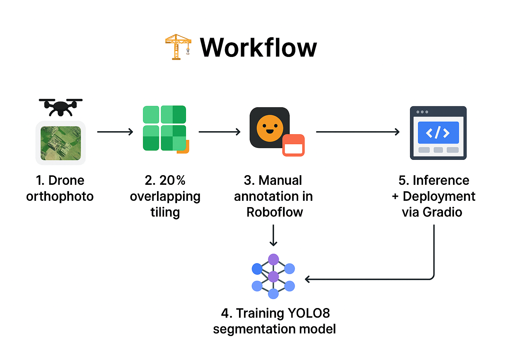

<h1 align="center">🌍 Orthophoto Analysis</h1>
<h3 align="center">AI-driven Feature Extraction from Drone Orthophotos</h3>

<p align="center">
  <em>Turning raw drone data into structured geospatial intelligence — one tile at a time.</em>
</p>

---

<p align="center">
  <a href="LICENSE"></a>
  
  
  
  <a href="https://huggingface.co/spaces/kishoreElumalai/OrthophotoProject"></a>
</p>

---

## 📖 Overview  
**Orthophoto Analysis** is an end-to-end AI pipeline designed to extract meaningful features from **drone orthophotos**.  
The system can detect and segment **buildings, RCCs, tiled/tin roofs, roads, and waterbodies**, supporting **urban planning, disaster management, smart cities, and rural development**.  

---

## 🧩 My Journey  

This project began as part of the **Smart India Hackathon (SIH)** with the following challenge:  

> **Problem Statement ID:** 1705  
> **Title:** *Development and Optimization of AI model for Feature Identification/Extraction from Drone Orthophotos*  

### 🚀 How It Started  
I was fascinated by the possibility of mapping entire villages from drone images. But the first roadblock?  
👉 **No dataset.**  

I had just **10 orthophotos** from the [SWAMITVA Scheme](https://svamitva.nic.in/). That’s nowhere near enough for training.  

### 🛠 Building a Dataset from Scratch  
So I built my own:  
- Used a **20% overlapping tiling approach** → created **800+ tiles** (`640x640 px`)  
- Annotated manually in **Roboflow** into **6 classes**  

Yes, it was slow. Yes, it was frustrating.  
But I kept reminding myself:  

> *“Someone has to start building datasets, so others can innovate further. The first step is always the hardest.”*  

### 🤖 Model Training  
- Exported dataset → **YOLOv8 format**  
- Fine-tuned a **YOLOv8 segmentation model**  
- Results weren’t perfect but **satisfactory for a first dataset**  

The biggest lesson?  
👉 *AI isn’t magic — it’s data, persistence, and learning from mistakes.*  

---

## 🎯 Live Demo  
👉 [**Try the project live on Hugging Face 🚀**](https://huggingface.co/spaces/kishoreElumalai/OrthophotoProject)  

---

## 🏗 Workflow  
 <p align="center">
  
</p>


---

## 📊 Results  

| Feature        | IoU (%) | Precision | Recall |  
|----------------|---------|-----------|--------|  
| Buildings      | 92.1    | 91.4      | 90.8   |  
| Roads          | 89.5    | 88.9      | 87.2   |  
| Waterbodies    | 95.3    | 94.6      | 93.8   |  

### 🔍 Visual Examples  

| Input | Prediction |  
|-------|------------|  
|  |  |  
|  |  |  

---

## ⚙️ Setup & Installation  

### Step 1 : Clone the repository  
Open terminal in VS Code (`Ctrl + Shift + ~`) and run:  
```bash
git clone https://github.com/kishore3002/Orthophoto_Analysis.git
```

### Step 2 : Open the project folder
```bash
cd Orthophoto_Analysis
```

### Step 3 : Create a Virtual Environment

Windows (Command Prompt):
```bash
python -m venv venv
venv\Scripts\activate
```

Linux / macOS:
```bash
python3 -m venv venv
source venv/bin/activate
```

### Step 4 : Upgrade pip (Recommended)
```bash
pip install --upgrade pip
```

### Step 5 : Install dependencies (ultralytics,openCV,matplotlib,numpy etc..,)
```bash
pip install -r requirements.txt
```

### Step 6 : Run the application ( developed through gradio interface)
```bash
python app/app.py
```

### step 7 : Now open in your browser:
http://localhost:7860/

### Step 8 : Stop the application
Press Ctrl + C in the terminal to stop the server.

---
## 🛠 Tech Stack  

### 🔹 Languages & Core
<p align="center">
  
  
  
</p>

### 🔹 Machine Learning & CV
<p align="center">
  
  
  
  
</p>

### 🔹 Deployment & Hosting
<p align="center">
  
  
</p>

---

## 💡 Applications  

- 🏙️ **Urban Planning** – Analyze and classify roof types for city development  
- 🏠 **Property Taxation** – Assist authorities in property assessment & taxation  
- ☀️ **Solar Energy Planning** – Identify suitable rooftops for solar installations  
- 🌊 **Disaster Management** – Support flood/damage assessment using roof mapping  
- 🌐 **Smart Cities** – Enable real-time geospatial insights for smarter governance

---
## 🔮 Future Scope  

- 📊 **Expand Dataset** – Collect more villages & diverse roof types  
- 🗺️ **GIS Integration** – QGIS, Google Earth Engine for spatial insights  
- 📹 **Real-Time Processing** – Analyze live drone video streams  
- ⚡ **REST API** – FastAPI backend for scalable deployment  
- ☁️ **Cloud Deployment** – Integrate with AWS/GCP for large-scale use

---
## 🙏 Acknowledgements  
- 💡 **Smart India Hackathon (SIH)** – for the inspiring problem statement  
- 🛰️ **SWAMITVA Scheme** – source of orthophotos for dataset creation  
- 🛠️ **Roboflow** – powerful annotation tool for dataset labeling  
- 🤖 **Ultralytics YOLOv8** – backbone model for training & inference  

---
## 📬 Contact  

- 👤 **Kishore E**  
- 🐙 **GitHub:** [@kishore3002](https://github.com/kishore3002)  
- 💼 **LinkedIn:** [linkedin.com/in/kishore-offic](https://www.linkedin.com/in/kishore-offic)  
- 📧 **Email:** [ekishore134@gmail.com](mailto:ekishore134@gmail.com)  


## 📝 License
This project is licensed under the MIT License – free to use and modify with attribution.

---
✨ At its heart, this project is about **persistence**.  
The dataset may have been small. The results may not be state-of-the-art.  
But this journey taught me more than perfect accuracy ever could.  

👉 If you believe in taking that **first step — even when the road is unclear — then this project is for you.**  

⭐ If this inspired you, give it a star 

check out the **[Live Demo](https://huggingface.co/spaces/kishoreElumalai/OrthophotoProject)**.  


